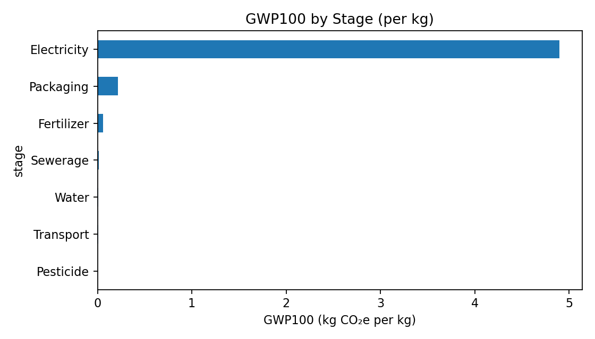
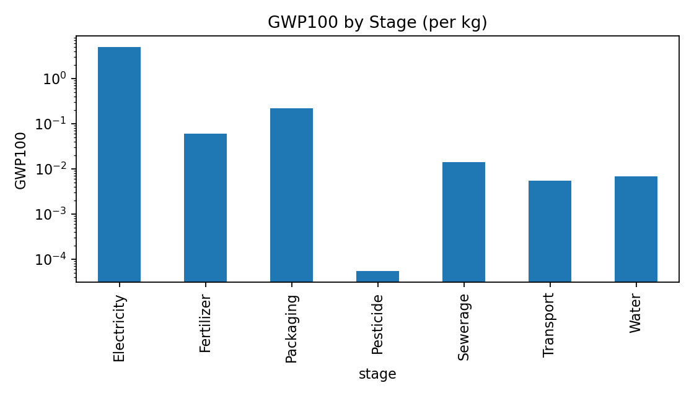
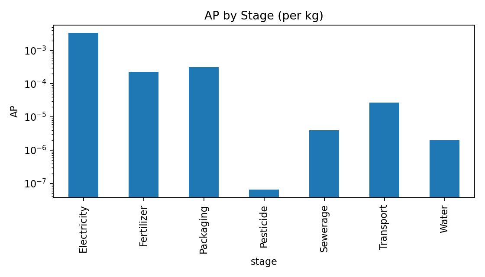
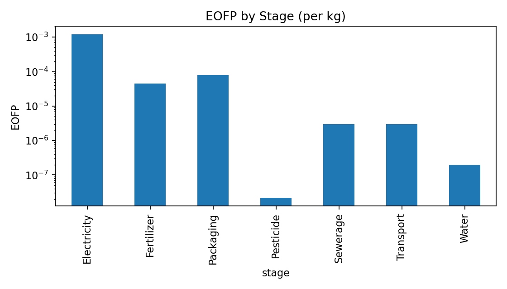

# VF LCIA Charts – Lettuce (per kg)

> This report is auto-generated from the LCIA workbook and includes every chart found in the output directory.

## Contents
- [Total Impact per Category](#totals)
- [LCIA by Stage (Stacked)](#stacked)
- [GWP100 by Stage (Pie/Bar)](#gwp)
- [Normalized Radar (if available)](#radar)
- [Top Flows by GWP100](#topflows)
- [Normalized by Stage (Stacked 0–1)](#normstage)
- [Per-Category Stage Bars](#percat)

## Total Impact per Category {#totals}

## LCIA by Stage (Stacked) {#stacked}

## GWP100 by Stage (Pie/Bar) {#gwp}

## Normalized Radar (if available) {#radar}
_Chart not generated or normalization sheet missing._

## Top Flows by GWP100 {#topflows}

## Normalized by Stage (Stacked 0–1) {#normstage}

## Per-Category Stage Bars {#percat}
_One chart per impact category showing per-stage values._

### GWP100

### HOFP

### PMFP

### AP

### EOFP

### FFP

### stacked

